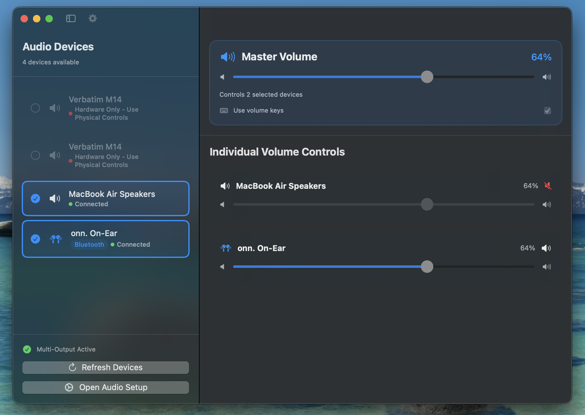
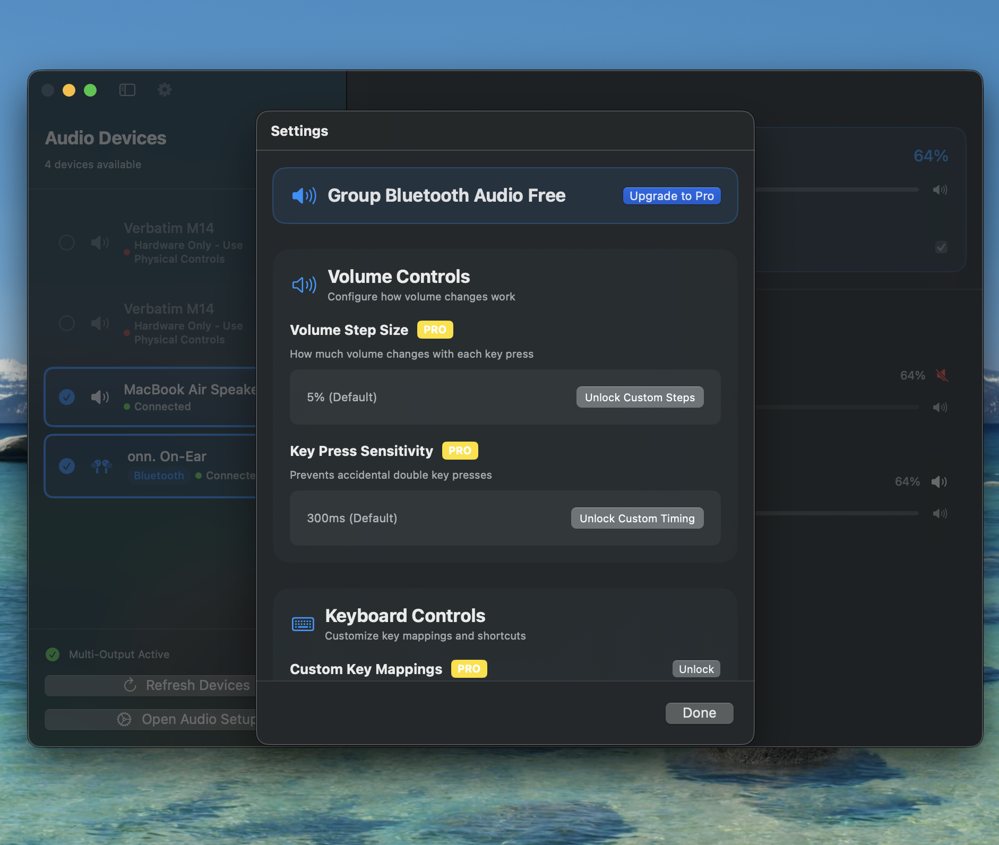
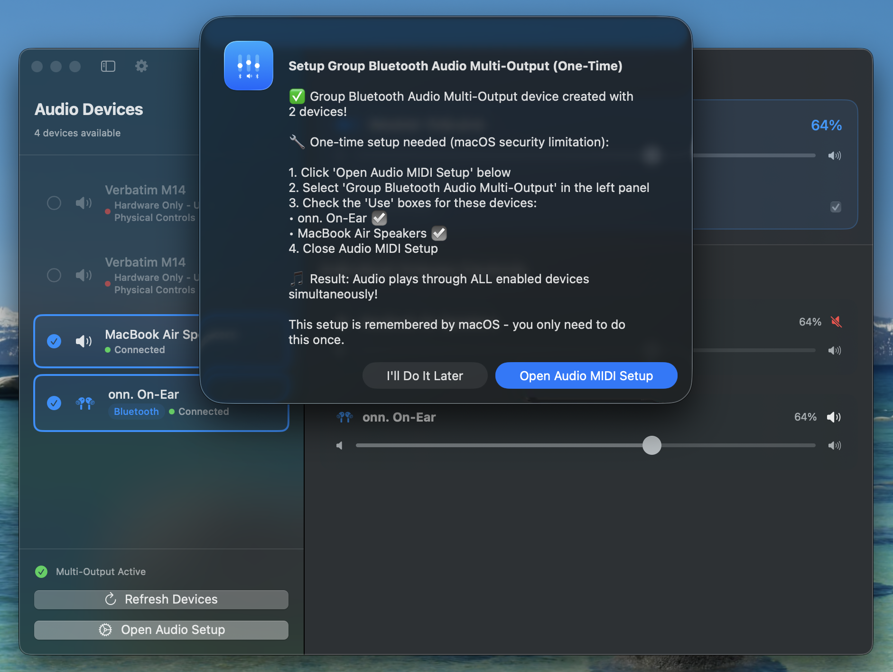
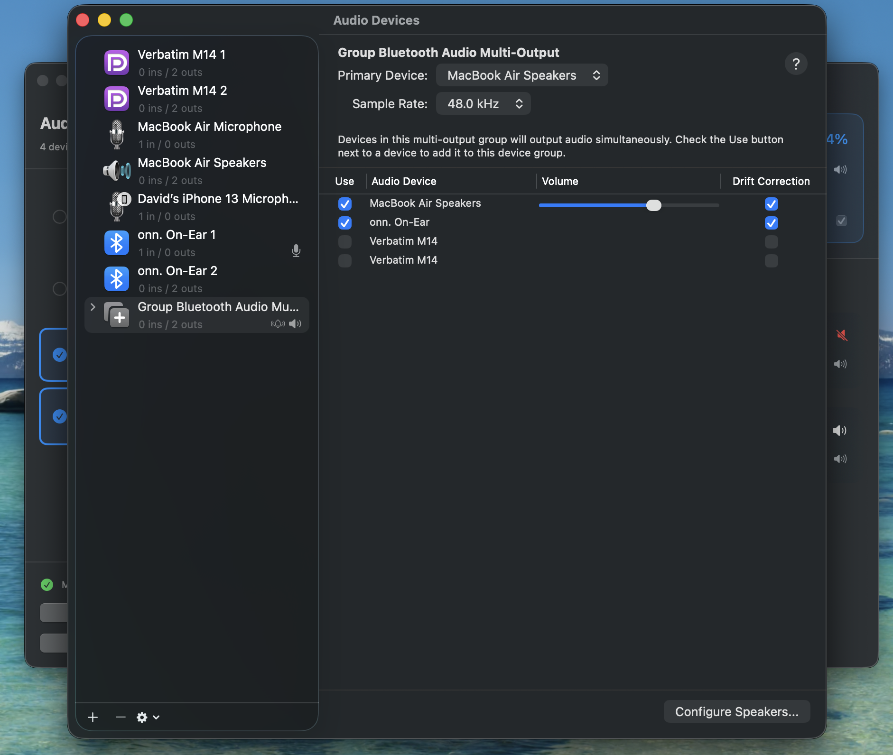

# 🎵 Group Bluetooth Audio

**Transform your macOS audio experience with seamless multi-device Bluetooth management**

---

## ✨ Features

### 🆓 **FREE Core Features**
- **Connect Multiple Devices**: Pair unlimited Bluetooth audio devices simultaneously
- **Individual Volume Control**: Adjust each device's volume independently with precision sliders
- **Real-Time Monitoring**: See connection status and audio levels for all devices
- **Smart Device Detection**: Automatically recognizes Bluetooth audio equipment
- **Menu Bar Integration**: Quick access controls without opening the main window
- **Multi-Output Creation**: Creates system-level aggregate devices for seamless playback

### 👑 **Pro Features** ($19.99 one-time or $2.99/month)
- **Custom Volume Steps**: Choose from 1%, 2%, 5%, 10%, or 15% increments
- **Custom Keyboard Shortcuts**: Assign personalized hotkeys for all functions
- **Advanced Key Response**: Adjustable sensitivity (100ms-1000ms)
- **Enhanced Menu Bar Controls**: Extended quick-access features

---

## 📱 Screenshots

### Main Interface

*Connect multiple devices and control volumes independently*

### Pro Settings Panel

*Advanced customization options available with Pro upgrade*

---

## 🚀 Quick Setup Guide

Getting started with Group Bluetooth Audio is simple:

### Step 1: Initial Setup

When you first connect multiple devices, the app will:
1. ✅ Create a "Group Bluetooth Audio Multi-Output" device
2. 🔧 Guide you through one-time macOS setup
3. 📋 Provide clear instructions for Audio MIDI Setup

### Step 2: Audio MIDI Setup (One-Time Only)

**Required due to macOS security limitations:**
1. Click "Open Audio MIDI Setup" 
2. Select "Group Bluetooth Audio Multi-Output" in the left panel
3. Ensure your devices are checked in the "Use" column
4. Close Audio MIDI Setup

**That's it!** Audio now plays through ALL enabled devices simultaneously.

---

## ⚡ Why Group Bluetooth Audio?

### The Problem
Traditional macOS audio tools force you to:
- Manually switch between devices 
- Can't handle multiple Bluetooth devices effectively
- Require complex workarounds for multi-output audio

### Our Solution
Group Bluetooth Audio leverages Apple's CoreAudio technology to create true multi-output devices that:
- ✅ Work with ANY audio application (Spotify, Zoom, Final Cut Pro, etc.)
- ✅ Appear as standard audio devices throughout macOS
- ✅ Handle Bluetooth timing and synchronization automatically
- ✅ Provide individual volume control for each device

---

## 🔧 Technical Excellence

- **Native macOS**: Built with Swift/SwiftUI for optimal performance
- **CoreAudio Integration**: Professional-grade audio handling
- **Privacy Focused**: No data collection, no analytics, no network requirements
- **System Integration**: Works seamlessly with macOS audio architecture
- **Compatibility**: macOS 13.0+ (Ventura and later)

---

## 💡 Perfect For

- **Content Creators**: Distribute audio to multiple outputs during recording
- **Music Enthusiasts**: Enjoy music on various devices simultaneously
- **Professionals**: Present to multiple audio zones
- **Home Users**: Fill your space with synchronized sound
- **Anyone frustrated with macOS audio switching limitations**

---

## 🐛 Bug Reports & Feature Requests

Found a bug or have a feature request? We'd love to hear from you!

### 🚨 Report Issues
- [**Bug Report**](https://github.com/dcherrera/group-bluetooth-audio-website/issues/new?template=bug_report.md): Something not working as expected?
- [**Feature Request**](https://github.com/dcherrera/group-bluetooth-audio-website/issues/new?template=feature_request.md): Have an idea to make the app better?
- [**General Discussion**](https://github.com/dcherrera/group-bluetooth-audio-website/discussions): Questions, tips, or general feedback

### 📋 Before Reporting
Please check our [**Known Issues**](https://github.com/dcherrera/group-bluetooth-audio-website/issues?q=is%3Aissue+is%3Aopen+label%3A%22known+issue%22) first to avoid duplicates.

---

## 📞 Support

- 📧 **Email Support**: theherrerahomestead@gmail.com
- 🐛 **Bug Reports**: [GitHub Issues](https://github.com/dcherrera/group-bluetooth-audio-website/issues)
- 💬 **Community**: [GitHub Discussions](https://github.com/dcherrera/group-bluetooth-audio-website/discussions)
- 📖 **Documentation**: [Setup Guide](SETUP.md) | [FAQ](FAQ.md)

---

## 📄 License

Group Bluetooth Audio is proprietary software. This repository is for bug tracking, feature requests, and community discussion only.

---

**Made with ❤️ for the macOS community**

*Transform your audio experience today - download Group Bluetooth Audio from the Mac App Store!*